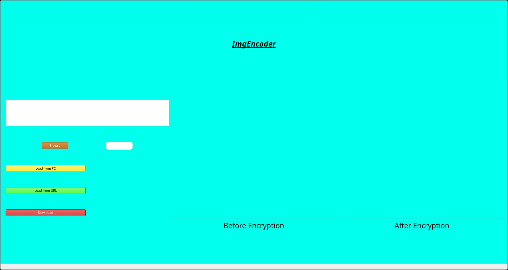

# ImgEncoder

## An Application that can encode and decode an image. Written in C++
Its main purpose is to encrypt images to a non-identifiable form

## Dependencies needed
The dependencies needed to compile the project are:
>1. CMake
>1. opencv
>1. qt5-base **/** qt6-base

## To install in PC

```bash
git clone https://github.com/Kunta-tech/ImgEncoder.git
cd ImgEncoder
cmake .
cmake --build . --target all
```

## Usage



#### It has a very simple user interface-
- A Single Text Box to enter Filepath on the PC or a valid URL.
- To get the file path you can also use the browse button to open a file menu window.
- A Password Box to give the pin (The pin should always be 4 digit numeric value)
- A button to load pictures from your computer
- A button to load pictures from the internet
- A Download button to download the generated image

### Example
---

<div style="display: flex;">
<style>
    img {
        border-radius: 9px;
    }
</style>
    <div>
    
    </div>
    <br>
    Among Us 🤫
    <div>
    
    <br>
    The encrypted image(The pin is 2023)
    </div>
</div>

---
